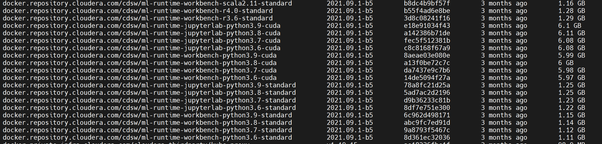
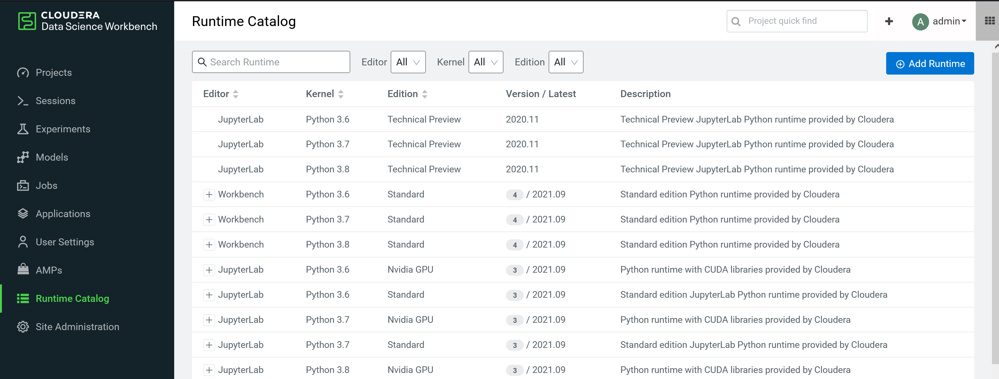
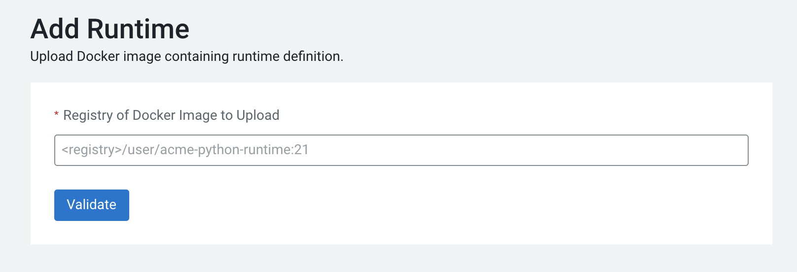
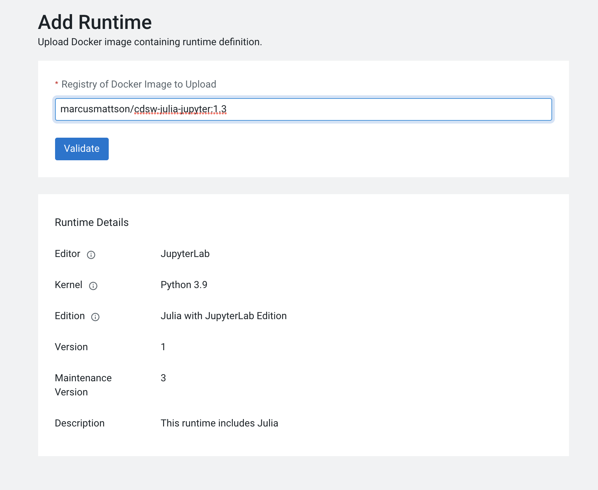
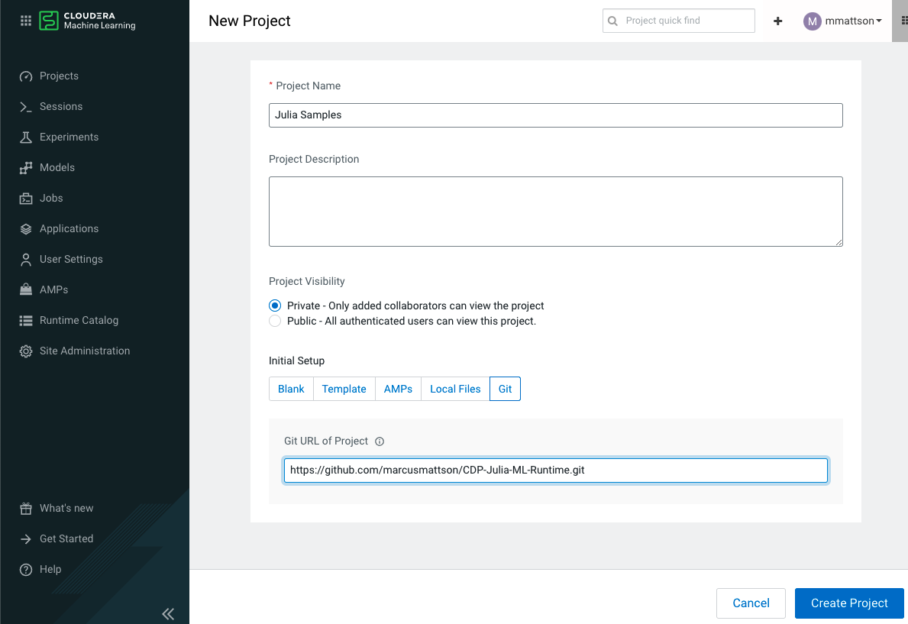
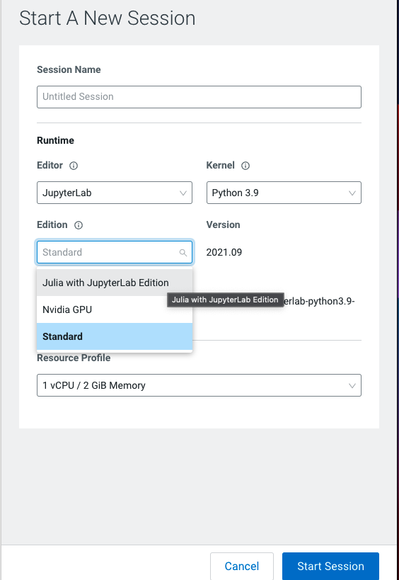

# CDP-Julia-ML-Runtime
Custom ML runtimes for use with Cloudera Data Platform Machine Learning

Cloudera Machine Learning environments (CDSW, CML) utilize Docker images to provide compute enivronments. The base Docker images provided by Cloudera may be extended to better fit a given purpose. This example demonstrates how to add the Julia programming language for use with CDSW and CML.

- **Content**
    - Construct the Dockerfile
    - Build Docker image
    - Push Docker image to a repository
    - Add the custom ML runtime
    - Install Julia packages and iJulia
    - Examples for usage

## Construct the Dockerfile
Create two Dockerfiles: one for a standard workbench, one for JupyterLab. The images are built starting from a base Cloduera-provided image. In CDSW the images are located on the CDSW nodes. Listing the Docker images from the CDSW master node will display the information needed to select a base image.
```bash
docker images
```


- Standard Workbench ML runtime
    ```bash
    # Dockerfile
    # Specify an ML Runtime base image
    FROM docker.repository.cloudera.com/cdsw/ml-runtime-workbench-python3.9-standard:2021.09.1-b5
    # Install ImageAI and dependenices in the new image
    RUN apt-get update && apt-get install curl gzip
    # Upgrade packages in the base image
    RUN apt-get update && apt-get upgrade -y && apt-get clean && rm -rf /var/lib/apt/lists/*
    #Install Julia
    RUN mkdir /opt/julia
    ADD julia.tar.gz /opt/julia
    RUN ln -s /opt/julia/julia-${JULIA_VERSION}/bin/* /usr/local/bin
    RUN rm -rf julia.tar.gz
    # Override Runtime label and environment variables metadata
    ENV ML_RUNTIME_EDITION="Julia Edition" ML_RUNTIME_SHORT_VERSION="1" ML_RUNTIME_MAINTENANCE_VERSION="2" ML_RUNTIME_FULL_VERSION="1.2" ML_RUNTIME_DESCRIPTION="This runtime includes Julia"
    LABEL com.cloudera.ml.runtime.edition=$ML_RUNTIME_EDITION com.cloudera.ml.runtime.full-version=$ML_RUNTIME_FULL_VERSION com.cloudera.ml.runtime.short-version=$ML_RUNTIME_SHORT_VERSION com.cloudera.ml.runtime.maintenance-version=$ML_RUNTIME_MAINTENANCE_VERSION com.cloudera.ml.runtime.description=$ML_RUNTIME_DESCRIPTION
    ```

- JupyterLab ML runtime

    The Metadata section is important. It can be maually entered or the values can be dynamically updated using environment variables. See this Cloudera page for more information:
    *[ML Runtime Metadata](https://docs.cloudera.com/machine-learning/cloud/runtimes/topics/ml-metadata-for-custom-runtimes.html)*

    ```bash
    # Dockerfile
    # Specify an ML Runtime base image
    FROM docker.repository.cloudera.com/cdsw/ml-runtime-jupyterlab-python3.9-standard:2021.09.1-b5
    # Install Julian in the new image
    RUN apt-get update && apt-get install curl gzip
    # Upgrade packages in the base image
    RUN apt-get update && apt-get upgrade -y && apt-get clean && rm -rf /var/lib/apt/lists/*
    #Install Julia
    RUN mkdir /opt/julia
    # before ADDing, make sure the file to be added is at the file path
    ADD julia.tar.gz /opt/julia
    RUN ln -s /opt/julia/julia-${JULIA_VERSION}/bin/* /usr/local/bin
    RUN rm -rf julia.tar.gz
    # Override Runtime label and environment variables metadata
    ENV ML_RUNTIME_EDITION="Julia Edition" ML_RUNTIME_SHORT_VERSION="1" ML_RUNTIME_MAINTENANCE_VERSION="2" ML_RUNTIME_FULL_VERSION="1.2" ML_RUNTIME_DESCRIPTION="This runtime includes Julia"
    LABEL com.cloudera.ml.runtime.edition=$ML_RUNTIME_EDITION com.cloudera.ml.runtime.full-version=$ML_RUNTIME_FULL_VERSION com.cloudera.ml.runtime.short-version=$ML_RUNTIME_SHORT_VERSION com.cloudera.ml.runtime.maintenance-version=$ML_RUNTIME_MAINTENANCE_VERSION com.cloudera.ml.runtime.description=$ML_RUNTIME_DESCRIPTION
    ```

## Build Docker Image
To build the Docker image using the ADD command, you will need to have the target of the ADD at the path defined in the ADD statement. If a full path is not provided, the ADD target should be present in the current directory. To obtain the current version of Julia, use these commands:

Set the Jullia version and extract the minor version to automatee downlaoding of the most recent version
```bash
JULIA_VERSION=$(curl -s "https://api.github.com/repos/JuliaLang/julia/releases/latest" | grep -Po '"tag_name": "v\K[0-9.]+')
```
```bash
JULIA_MINOR_VERSION=$(echo $JULIA_VERSION | grep -Po "^[0-9]+.[0-9]+")
```

Download the most recent version into a file named **julia.tar.gz**
```bash
curl -o julia.tar.gz "https://julialang-s3.julialang.org/bin/linux/x64/${JULIA_MINOR_VERSION}/julia-${JULIA_VERSION}-linux-x86_64.tar.gz"
```

Build the image
```bash
docker build --network=host -t repository_name/cdsw-julia-jupyter:1.1 . -f Dockerfile
```
## Push Docker Image to a Repository
Once the image is built, push it to a personal or organization's repository. The following is a simple example:

```bash
docker push repository_name/cdsw-julia-jupyter:1.1
```
## Add the Custom ML Runtime 
Once the Docker image has been built and pushed, it can be added to the Runtime Catalog.


1. Select **Add Runtime**
2. **Validate** the URL for your custom runtime image
    
3. Confirm metadata and select **Add to Catalog**
    

## Examples for Usage
Example notebooks are based on Data Science Tutorials created by [Julia AI GitHub](https://github.com/Juliaai) and located here [https://juliaai.github.io/DataScienceTutorials.jl](https://juliaai.github.io/DataScienceTutorials.jl/)

To use the sanple notebooks
1. Create a new **Project** using the Git tab

2. Create a new **Session** and select the following options
    **Editor**: JupyterLab
    **Kernel**: Python 3.9
    **Edition**: Julia with JupyterLab Edition
    **Enable Spark**: *Select Spark of choice*
    **Resource Profile**: *Select resources needed*
3. Select **Start Session**


4. Open a Terminal Access session and execute the following script to update Julia package registry and add the Julia kernel
   ```julia ./project-files/iJulia.jl```

